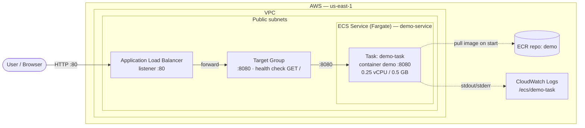
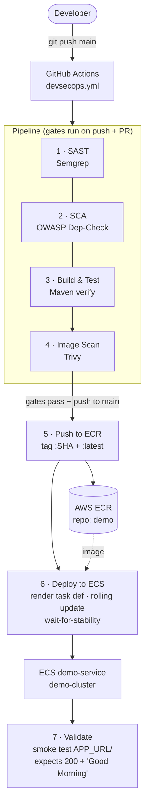

# Architecture — Spring Boot Demo on ECS Fargate

Reference diagram for the team / access request. Two flows:

1. **Runtime path** — a browser hits a URL and the request is served by a container.
2. **Delivery path** — a `git push` ships a scanned image into ECR and rolls it onto ECS.

> Account `535181393425` · Region `us-east-1` · ECR repo `demo` · Container port `8080`

---

## 1. Runtime request flow (URL → ALB → Fargate)

**Path in words:** `User → ALB :80 → Target Group :8080 → Fargate task (Spring Boot :8080) → "Good Morning" response`. The task pulls its image from ECR at startup and streams logs to CloudWatch.

### Security groups (the "access" part)
| From | To | Port | Rule |
|------|----|------|------|
| `0.0.0.0/0` (internet) | ALB SG | 80 | inbound allow |
| ALB SG | Task SG | 8080 | inbound allow (only from ALB) |
| Task SG | ECR / CloudWatch | 443 | outbound (image pull + logs) |

Tasks run in public subnets with **Assign public IP = ENABLED** so they can reach ECR. The container is never exposed directly — only the ALB is internet-facing.

---

## 2. Delivery flow (git push → CI/CD → ECR → ECS)

**Jobs 1–4** run on every push **and** PR (security gates). **Jobs 5–7** run **only on push to `main`** after the gates pass. Job 6 is tied to the GitHub `production` environment (optional manual-approval gate). Each image is tagged with the commit SHA for traceability, plus `latest`.

---

## Components & access checklist

| Component | What it is | Access needed |
|-----------|-----------|---------------|
| **GitHub Actions** | CI/CD runner | Repo secrets `AWS_ACCESS_KEY_ID` / `AWS_SECRET_ACCESS_KEY` (IAM user with ECR push + ECS deploy) |
| **ECR** (`demo`) | Private image registry | Pipeline pushes; ECS **task execution role** pulls |
| **ECS Cluster** (`demo-cluster`) | Fargate serverless compute | — |
| **ECS Service** (`demo-service`) | Keeps 1 task running, registers it with the ALB target group | — |
| **Task Definition** (`demo-task`) | Container `demo`, port 8080, execution role | Execution role needs **ECR pull + CloudWatch logs** |
| **ALB** | Internet-facing entry point, :80 → :8080 | ALB SG inbound 80 from internet |
| **Target Group** | Health-checks `GET /`, routes to tasks | Task SG inbound 8080 **from ALB SG only** |
| **CloudWatch Logs** (`/ecs/demo-task`) | Container stdout/stderr | Execution role |
| **IAM** | Two roles: GitHub deploy user + ECS task execution role | See above |

### The two IAM identities to request
1. **CI deploy user** (keys in GitHub Secrets): `ecr:*` push/pull on repo `demo`, `ecs:DescribeTaskDefinition`, `ecs:RegisterTaskDefinition`, `ecs:UpdateService`, `ecs:DescribeServices`, `iam:PassRole` for the execution role.
2. **ECS task execution role** (`ecsTaskExecutionRole`): managed policy `AmazonECSTaskExecutionRolePolicy` (ECR pull + CloudWatch logs).
